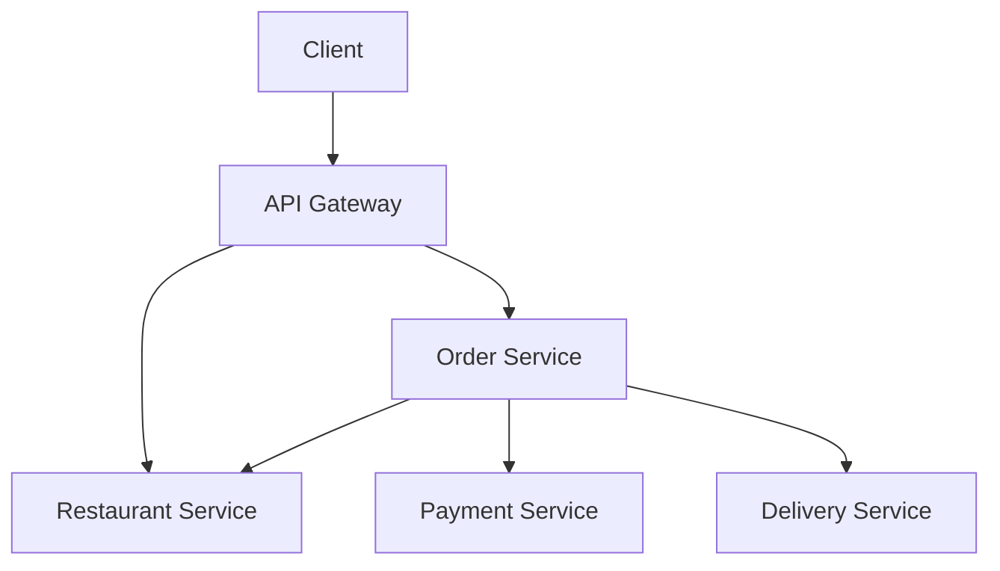

# ESGIEats – Documentation d'Architecture

> Projet réalisé dans le cadre du cours **Architecture | Micro Service**

---

## 1. Vue d’ensemble

**ESGIEats** est une plateforme de livraison de repas faites en microservices, simulant un type comme
UberEats.  
Chaque fonctionnalité principale est isolée dans un service indépendant.

---

## 2. Microservices

| Service              | Responsabilités principales                                          |
|----------------------|----------------------------------------------------------------------|
| `gateway`            | Point d’entrée unique (route les requêtes REST)                      |
| `order_service`      | Orchestrateur de commandes, applique le pattern SAGA                 |
| `restaurant_service` | Gère les menus, la validation des plats, l’acceptation des commandes |
| `payment_service`    | Simule un paiement (succès ou échec aléatoire)                       |
| `delivery_service`   | Assigne un livreur de manière simulée                                |

---

## 3. Choix techniques

- **Architecture** : microservices REST, orchestrés via `order_service`
- **Communication** : synchrone (HTTP) via `axios`
- **Données** : simulées (`restaurants.json`), aucune base persistante
- **Cohérence** : validée manuellement dans `order_service` (restaurant, items)
- **Transactions distribuées** : pattern SAGA (orchestration)
- **Résilience** :
    - Paiement peut échouer (simulation)
    - Gestion des erreurs centralisée (codes 400, 404, 500)

---

## 4. SAGA – Commande orchestrée

```mermaid
sequenceDiagram
    participant Client
    participant Gateway
    participant OrderService
    participant RestaurantService
    participant PaymentService
    participant DeliveryService

    Client->>Gateway: POST /api/order
    Gateway->>OrderService: POST /order
    OrderService->>RestaurantService: GET /restaurants/:id/menu
    alt Restaurant not found
        OrderService-->>Gateway: 404
    alt else Items not valid
        ORderService-->>Gateway: 400
    else Items valid
        OrderService->>RestaurantService: POST /:id/orders
        alt Restaurant refuses
            OrderService-->>Gateway: 400
        else Restaurant accepts
            OrderService->>PaymentService: POST /payment
            alt Payment fails
                OrderService-->>Gateway: 500
            else Payment succeeds
                OrderService->>DeliveryService: POST /delivery
                DeliveryService-->>OrderService: 200 OK
                OrderService-->>Gateway: 200 OK + total + items
            end
        end
    end
```

---

## 5. Conteneurs (Docker)



---

## 6. Architecture Decision Records (ADRs)

| Décision                   | Justification                                             |
|----------------------------|-----------------------------------------------------------|
| Microservices indépendants | Permet l’évolutivité et la séparation des responsabilités |
| REST synchrone             | Simplicité, clarté pour un prototype                      |
| Orchestration SAGA         | Plus simple à mettre en œuvre que la chorégraphie         |
| Données mockées            | Pas de base nécessaire pour un prototype d’architecture   |
| Docker Compose             | Déploiement et test local faciles                         |

---

## 7. Cas testés et validés

- ✅ Commande OK → paiement → livraison
- ❌ Restaurant inexistant → 404
- ❌ Plat inexistant → 400
- ❌ Restaurant refuse → 400
- ❌ Paiement échoue → 500

---

## 8. Fichier restaurants.json

- Contient 10 restaurants
- Chaque restaurant a 10 plats
- IDs de plats et restaurants sont globaux et uniques

---

## Conclusion

Ce projet démontre la capacité à :

- Concevoir une architecture distribuée claire
- Gérer un processus métier critique via SAGA
- Simuler des défaillances et y réagir proprement
